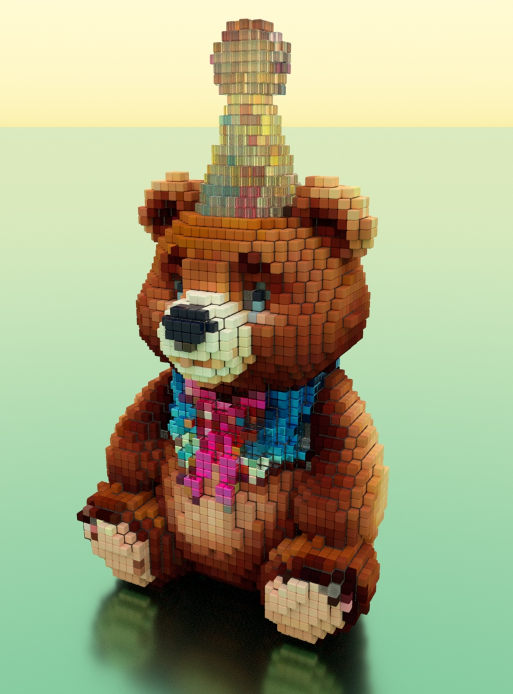

# poomer-discord-vmax

C++ Learning prototype Discord bot that converts [VoxelMax](https://voxelmax.com) .vmax.zip to DiffuseLogic's [Bella](https://bellarender.com) .bsz, renders and returns jpeg




#### Commands

- Upload .vmax.zip files - I'll automatically render them
- `/queue` - See current render queue
- `/history` - View recently completed renders
- `/remove` - Cancel current rendering job (your own jobs or admin)

VoxelMax features supported
- metallness converted to Bella metal quickmaterial (not PBR), roughness supported
- Material 7 is Glass
- Material 8 is Liquid and is always a mesh
- 0 roughness is converted to Oren-Nayar diffuse
- opacity < 255 turns into Glass
- roughness > 0 converted to Bella Plastic
- emitter supported
- on iOS/iPadOS save as .vmax to Files and then long press and use compress, drop .vmax.zip into Discord
# Build

```
workdir/
├── bella_engine_sdk/
├── DPP/
├── libplist/
├── lzfse/
├── opengametools/
└── poomer-discord-vmax/
```

# MacOS
Install Cmake to /Applications
```
curl -LO https://github.com/Kitware/CMake/releases/download/v3.31.6/cmake-3.31.6-macos-universal.dmg
open cmake-3.31.6-macos-universal.dmg
```

```
mkdir workdir
curl -LO https://downloads.bellarender.com/bella_scene_sdk-25.3.0-macos.zip
unzip bella_scene_sdk-25.3.0-macos.zip
git clone https://github.com/lzfse/lzfse
mkdir -p lzfse/build
cd lzfse/build
/Applications/CMake.app/Contents/bin/cmake -DCMAKE_OSX_ARCHITECTURES="x86_64;arm64" ..
make -j4
cd ../..
mkdir homebrew
curl -L https://github.com/Homebrew/brew/tarball/master | tar xz --strip-components 1 -C homebrew
eval "$(homebrew/bin/brew shellenv)"
brew update --force --quiet
brew install libtool autoconf automake openssl
git clone https://github.com/brainboxdotcc/DPP.git
cd DPP
/Applications/CMake.app/Contents/bin/cmake -B ./build \
  -DCMAKE_OSX_ARCHITECTURES="arm64;x86_64" \
  -DCMAKE_OSX_DEPLOYMENT_TARGET=11.0 \
  -DOPENSSL_ROOT_DIR=../homebrew/opt/openssl@3 \
  -DOPENSSL_INCLUDE_DIR=../homebrew/opt/openssl@3/include \
  -DOPENSSL_CRYPTO_LIBRARY=../homebrew/opt/openssl@3/lib/libcrypto.a \
  -DOPENSSL_SSL_LIBRARY=../homebrew/opt/openssl@3/lib/libssl.a
/Applications/CMake.app/Contents/bin/cmake --build ./build -j8
cd ..
git clone https://github.com/libimobiledevice/libplist.git
cd libplist
export CFLAGS="-arch arm64 -arch x86_64"                                        
export CXXFLAGS="-arch arm64 -arch x86_64"
export LDFLAGS="-arch arm64 -arch x86_64"
./autogen.sh --prefix=$PWD/install --without-cython
make -j4
install_name_tool -id @rpath/libplist-2.0.4.dylib src/.libs/libplist-2.0.4.dylib
cd ..
git clone https://github.com/jpaver/opengametools.git
git clone https://git.indoodle.com/oomer/oom.git
git clone https://git.indoodle.com/oomer/poomer-discord-vmax.git
cd poomer-discord-vmax
make all -j
install_name_tool -change ../lzfse/build/liblzfse.dylib @rpath/liblzfse.dylib bin/Darwin/release/poomer-discord-vmax
install_name_tool -change /usr/local/lib/libplist-2.0.4.dylib @rpath/libplist-2.0.4.dylib bin/Darwin/release/poomer-discord-vmax
```

## Linux 

```
sudo apt install build-essential autoconf automake libtool pkg-config
mkdir workdir
curl -LO https://downloads.bellarender.com/bella_engine_sdk-25.3.0-linux.tar.gz
tar -xvf  bella_engine_sdk-25.3.0-linux.tar.gz
git clone https://github.com/brainboxdotcc/DPP.git
cd DPP
cmake -B ./build
cmake --build ./build -j
cd ..
git clone https://github.com/lzfse/lzfse
mkdir lzfse/build
cd lzfse/build
cmake ..
make -j4
cd ../..
git clone https://github.com/libimobiledevice/libplist.git
cd libplist
./autogen.sh --prefix=$PWD/install --without-cython
make -j4
cd ..
git clone https://github.com/jpaver/opengametools.git
git clone https://git.indoodle.com/oomer/oom.git
git clone https://github.com/oomer/poomer-discord-vmax.git
cd poomer-discord-vmax
make all -j4
```

## Windows 
- [TODO] DPP build instructions
- [optional] Install https://git-scm.com

- Download Visual Studio Community Edition 2022
- Run VisualStudioSetup.exe
- Workload = [x] Desktop development with C++
- Individual components = [x] Git For Windows

#### x64 Developer console
```
mkdir workdir
curl -LO https://downloads.bellarender.com/bella_engine_sdk-25.3.0-win32.zip
tar -xf bella_engine_sdk-25.3.0-win32.zip
git clone https://github.com/lzfse/lzfse
mkdir -p lzfse/build
cd lzfse/build
cmake ..
msbuild lzfse.vcxproj /p:Configuration=release /p:Platform=x64 /p:PlatformToolset=v143
cd ../..
git clone https://github.com/jpaver/opengametools.git
git clone https://git.indoodle.com/oomer/oom.git
git clone https://git.indoodle.com/oomer/libplist
cd libplist
msbuild libplist.vcxproj /p:Configuration=release /p:Platform=x64 /p:PlatformToolset=v143
cd ..
git clone https://github.com/oomer/poomer-discord-vmax.git
cd poomer-discord-vmax
msbuild poomer-discord-vmax.vcxproj /p:Configuration=release /p:Platform=x64 /p:PlatformToolset=v143
```
